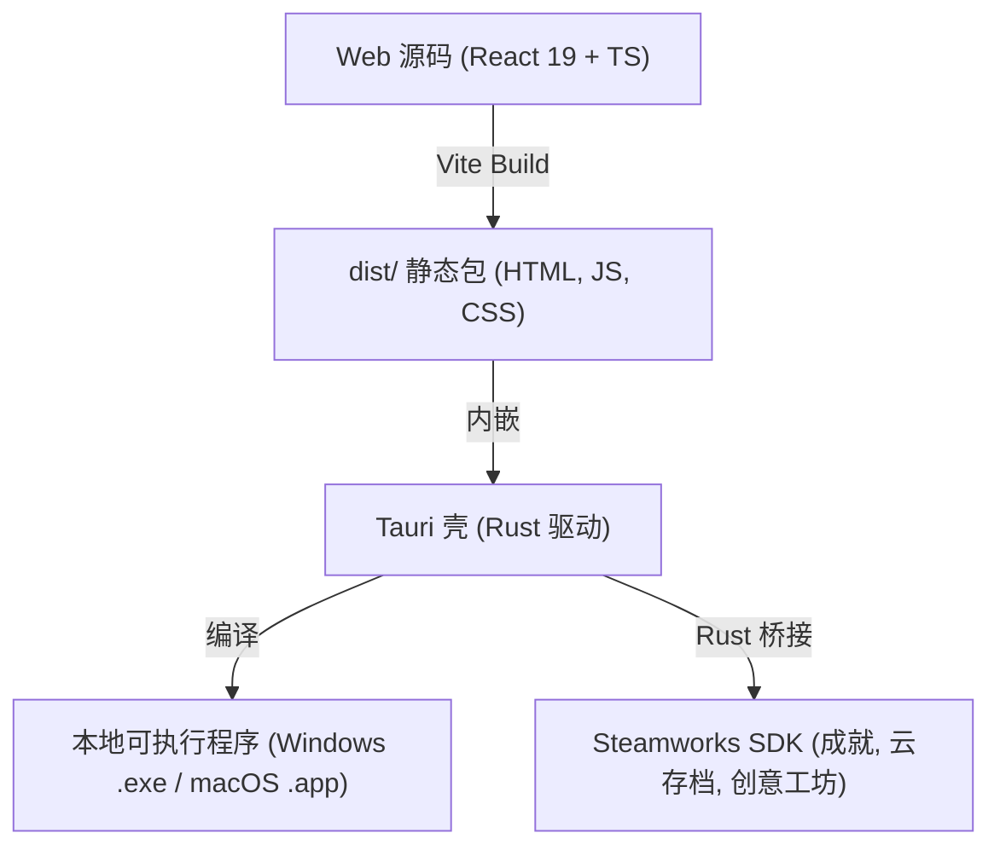

# AUDIT_20260603_GODOT_MIGRATION_FEASIBILITY | 《宇宙群英传》Godot 移植可行性评估与技术选型报告

> **评估日期**: 2026-06-03  
> **分类前缀**: `AUDIT_` (审计与评估报告)  
> **当前状态**: 已归档并同步至 GitHub  

---

## 📖 1. 背景与评估目的

《宇宙群英传：三体重构》目前正处于从 C++/MFC/DirectX 9 遗产代码向现代技术栈迁移的关键节点。目前 Web 重构版（React 19 + TypeScript + Vite）已初具规模，且建立了稳固的自动化测试防线。

本报告旨在从**开发效率、UI 复杂度、逻辑复用度、测试保障体系以及发布分发渠道**五个关键维度，深度对比“继续 Web 版开发”与“移植至 Godot 引擎”的利弊，并给出最终的技术路线选型建议。

---

## 📊 2. 核心方案对比

| 评估维度 | 方案 A：继续 Web 重构版 (React + TS + Vite) | 方案 B：移植至 Godot 引擎 (GDScript / C#) |
| :--- | :--- | :--- |
| **UI 布局与信息密度** | 🟢 **极强**。利用 HTML5/CSS3 (Tailwind CSS 4) 对高密度表格、11 个部门面板、85 节点科技树进行栅格化排版，效率极高。 | 🔴 **繁琐**。Godot 的 Control 节点系统在处理大量自适应文本、动态滚屏和复杂表单嵌套时较为臃肿，维护成本高。 |
| **核心逻辑重构风险** | 🟢 **零风险**。现有的 TS 纯逻辑层（事件引擎、骰子战斗、外交决策）已完全实现并运行稳定。 | 🔴 **高风险**。需将数千行策略模拟逻辑翻译为 GDScript/C#，易重新引入数值溢出、Epoch 进程死锁等底层 Bug。 |
| **测试与质量保障** | 🟢 **极强**。依赖 Vitest + JSDOM，可在 2 秒内跑完 262 个单元/集成测试，实现 Headless 挂机回归。 | 🔴 **弱**。缺乏轻量级、超高速的纯数据模拟测试框架，对 100+ 回合的策略算法做质量守卫非常困难。 |
| **多平台与分发成本** | 🟢 **极低**。网页端一键即玩，支持 macOS/Win/Linux/手机端，支持通过 Tauri 极速打包为桌面端。 | 🟡 **中等**。虽支持多平台导出，但其 Web 导出（Wasm）体积庞大，在移动端浏览器常因内存或安全限制出现异常。 |
| **音画与视觉表现上限** | 🟡 **中等**。基于 Canvas 2D 进行星图渲染，虽能满足 2D 策略定位，但难以呈现复杂的 3D 舰队战与高级着色器特效。 | 🟢 **极强**。原生支持 2D/3D 渲染管线、粒子系统与着色器，适合制作“水滴横扫舰队”、“二向箔空间坍缩”等炫酷视觉。 |

---

## 🔍 3. 游戏特征契合度分析

《宇宙群英传》的本质是一项**高密度信息面板的设计与海量数值状态机的维护**。它不像即时动作或物理竞速游戏那样重度依赖 GPU 渲染和碰撞检测，而是依赖于**回合结算的精确性**、**事件树的因果链**和**界面的响应速度**。

*   **UI 密度的决定性作用**：4X 策略类游戏的面板数量极多。Web 前端在响应式排版、动态样式绑定（ThemeManager）和字体渲染上的成熟度，是任何传统游戏引擎都难以企及的。
*   **开发迭代环路 (HMR)**：Vite 带来的瞬时热更新让策划在调整随机事件文本或修改战斗加成参数时，能在浏览器中秒级看到效果。而 Godot 每次修改都需要经历编译、引擎重新载入的过程，会显著降低中后期细节打磨的效率。

---

## 🚀 4. 针对桌面端（Steam 上架）的分发方案

即使不移植到 Godot，Web 重构版也可以通过**混合架构**完美解决上架 Steam 和离线运行的问题：

*   **Tauri 方案的优势**：使用系统自带的 Web 渲染器（Webview2/WebKit），打包出来的安装包体积仅约 10MB-15MB，内存占用极小。
*   **Steam 集成**：利用 Tauri 的 Rust 后端桥接 `steamworks-rs`，无需改动前端界面代码即可顺畅调用 Steam API。

---

## 🎯 5. 最终评估结论

**强烈建议：维持“继续 Web 重构版开发”的技术路线不变。**

目前 Web 版本底层逻辑链已基本打通，且拥有健全的覆盖率守卫（Vitest）。现阶段移植 Godot 不仅不能直接提升核心玩法乐趣，反而会因为“翻译代码”产生几个月的开发真空期，并面临逻辑失真和测试缺失的风险。

**后续路线建议**：
1.  优先按照 [RPLAN_20260602_COMPREHENSIVE_REMEDIATION.md](file:///Users/quantumrose/Documents/Emberois/LengendOfUni-rebuild/02_Project_Documentation/RPLAN_20260602_COMPREHENSIVE_REMEDIATION.md) 完成剩余阶段的修复与内容填充（如外交系统独立 UI、行星发动机子系统等）。
2.  在游戏内容丰满后，引入 **Tauri** 建立桌面版工程，作为未来上架 Steam 的技术储备。
