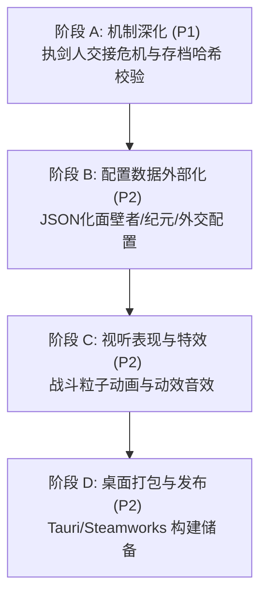

# SPEC_20260603_REVISED_ITERATION_PLAN | 《宇宙群英传：三体重构》新版迭代开发计划与 AI 协同指引

> **版本号**: V2.0 (基于重构修复后现状重新编订)  
> **制定日期**: 2026-06-03  
> **适用对象**: 人类总监、AI 协同编码助手  
> **分类前缀**: `SPEC_` (规格说明与迭代蓝图)  

---

## 📖 1. 概述与现状审计

经过近期的深度重构（截至 2026-06-03），项目已经完成了**阶段一至阶段四**的绝大部分 P0 级底层缺陷修复与核心系统建设。
目前，Web 重构版（React 19 + Vite 8 + TS 5）已处于高可用状态：
*   **已实现**：纯 TypeScript 逻辑层与 UI 层的彻底解耦，5 种 AI 人格决策树，5 轮骰子战斗系统，11 个部门 Slider 交互面板，行星发动机（变轨/启航/流浪），数字生命（上传/数据中心/数字体复活），威慑与面壁者计划，以及 262 个 100% 通过的 Vitest 单元/集成测试用例（覆盖率达 62.94%）。

为了将《宇宙群英传》打磨为一款无 Bug、高沉浸感、可直接上架 Steam 的策略成品，本规范根据《全局项目开发文档与归档管理规范》重新制定后续迭代计划，并提供完整的**“AI 开发提示词”**与**“人类总监操作指引”**。

---

## 📅 2. 新版迭代开发阶段计划

新一轮开发计划分为四个阶段，主要目标是**补全残留死角、实现配置外部化、提供桌面端打包支持、以及增强视听沉浸感**。



### 阶段 A：核心机制深化与数据防伪 (P1)
*   **任务 A-1：执剑人交接危机 (Swordholder Handover)**
    *   *说明*：当人类总监指派新的执剑人（如程心交接罗辑）时，触发“交接期脆弱窗口”。三体文明 AI 将评估新执剑人的威慑值与面壁属性。如果新执剑人领导力低或怀疑度极高，三体 AI 有高概率在交接回合立刻发动“水滴突袭”。
*   **任务 A-2：存档数据完整性校验 (Save Hash Checksum)**
    *   *说明*：在 `SaveManager` 序列化/反序列化本地 `localStorage` 存档时，追加基于 sha256 或简单加权校验和的 Hash 尾随码，并在载入时校验，防止玩家通过直接修改 LocalStorage 存档作弊或破坏状态机。

### 阶段 B：外部化配置系统建设 (P2)
*   **任务 B-1：wallfacer.json、epochs.json、diplomacy.json 数据化**
    *   *说明*：将硬编码在 `EarthCivilization.ts` 及 `Game.ts` 中的面壁者默认计划参数（进度增长率、破壁门槛）、纪元文化值阈值、6级外交状态乘数等彻底提取到 `src/data/` 目录下的 JSON 配置文件中，实现完全的数据驱动。

### 阶段 C：粒子动效与音效打磨 (P2)
*   **任务 C-1：BattleScreen 战斗微动画与粒子漂移**
    *   *说明*：利用 Framer Motion 在 [BattleScreen.tsx](file:///Users/quantumrose/Documents/Emberois/LengendOfUni-rebuild/03_Web_Rebuild/src/components/BattleScreen.tsx) 中加入战斗阶段武器对决的动态缩放、水滴撞击飞船的红白闪烁警报，以及文字战报的粒子漂移效果。
*   **任务 C-2：背景音乐与音效事件总线 (Audio Event Bus)**
    *   *说明*：扩展音频系统，在发生“二向箔预警”、“智子展开”、“进入威慑纪元”等关键历史节点时，自动切换相匹配的 BGM，并增加警报音效。

### 阶段 D：原生桌面端集成 (Tauri + Steamworks) (P2)
*   **任务 D-1：Tauri 桌面容器配置与打包**
    *   *说明*：在项目根目录下配置 Tauri 脚手架，将 Vite 编译生成的 `dist/` 静态产物无缝嵌入 Tauri 容器中，输出 Windows `.exe` 和 macOS `.app` 原生安装包。
*   **任务 D-2：Steam API 接入预备桥接**
    *   *说明*：在 Tauri 的 Rust 后端（`src-tauri`）中预留 `steamworks-rs` 的初始化接口，通过 Webview API 暴露给前端 React 组件，为后续成就解锁提供底层通路。

---

## 🤖 3. 面向 AI 的任务执行提示词 (Prompts for AI)

当您调用 AI 助手进行具体阶段的任务开发时，**必须直接复制以下对应的结构化提示词**发给 AI，以强制其遵守开发规范。

### 提示词 1：针对“阶段 A：执剑人交接危机与存档校验”开发
```markdown
你是一个精通 React 19 和 TypeScript 的游戏架构师。现在需要你实现《宇宙群英传》的【执剑人交接危机】与【存档哈希校验】功能。
请在修改任何代码前，严格遵守《全局项目开发文档与归档管理规范》，在 02_Project_Documentation 目录下创建 EXEC_[DATE]_PLAN.md 与 TASK.md。

执行要求：
1. 扩展 `EarthCivilization.ts`，在执剑人（swordholder）变更的当前回合，触发【交接脆弱期】标志。
2. 扩展 `AlienCivilization.ts` 的行为评估，如果触发了【交接脆弱期】，且新执剑人的 leadership 属性低于 60，三体 AI 将绕过常规冷却，有 75% 概率立即发动水滴突袭，并在历史大事记中记录“【交接危机】智子判定新任执剑人威慑度不足，水滴探测器发起饱和打击！”。
3. 扩展 `SaveManager.ts`，在 `saveGame` 时对序列化后的 JSON 字符串计算一个自定义的 Hash 签名，并追加在存档字段尾部；在 `loadGame` 时重新计算比对，若不一致则抛出 `SaveDataCorruptedError` 并不予加载。
4. 必须在 `src/test/core/Subsystems.test.ts` 中为上述两个新增功能编写 100% 覆盖分支的单元测试。
5. 编写完成后，运行 `npx vitest run --coverage` 与 `npm run build`，确保分支覆盖率不低于 60% 且零编译错误。
完成后，请输出 EXEC_[DATE]_WALKTHROUGH.md 交付验证文档。
```

### 提示词 2：针对“阶段 B：配置数据外部化”开发
```markdown
你是一个数据驱动架构师。请将《宇宙群英传》中面壁计划参数、纪元更迭阈值以及外交关系系数彻底外部化。
请在修改前，先创建会话伴生文档（PLAN.md 与 TASK.md）。

执行要求：
1. 在 `03_Web_Rebuild/src/data/` 下新建 `wallfacers.json`（面壁者基础参数）、`epochs.json`（纪元更迭的文化值阈值表）与 `diplomacy.json`（各外交等级的关系数值与系数映射）。
2. 修改 `TecTreeManager.ts`、`Game.ts` 和 `EarthCivilization.ts`，使用 fetch 或静态 import 加载上述配置文件，替代所有硬编码的魔法数字。
3. 保证原本的单元测试不受影响，运行 `npm run test` 进行回归测试，并补全针对数据解析失败时的降级防御逻辑。
完成后编写 WALKTHROUGH.md 并同步推送远程仓库。
```

---

## 👑 4. 人类总监操作与验收指引 (Director's Manual)

作为项目的**人类总监**，您无需亲自编写代码，但必须担任“质量守门人”。AI 完成开发并提交后，请按照以下步骤进行严格的质量验收（Quality Gate）：

```
[AI 提交代码] ──> 步骤 1. 审查伴生文档 ──> 步骤 2. 命令行跑测 ──> 步骤 3. UI 交互实测 ──> [批准合并/推送]
```

### 步骤 1：审查交付文档 (Review Deliverables)
*   **检查文件是否存在**：确认 AI 提交的代码中是否包含了以下三个文件：
    1.  `02_Project_Documentation/EXEC_[DATE]_PLAN.md`（修改思路是否合理，是否遵守非破坏性重构原则）
    2.  `02_Project_Documentation/EXEC_[DATE]_TASK.md`（任务 TODO 状态是否全部标记为 `[x]`）
    3.  `02_Project_Documentation/EXEC_[DATE]_WALKTHROUGH.md`（验证数据是否扎实）
*   **规范校验**：检查文档中引用的代码文件是否带有**绝对路径链接**（如 `[Game.ts](file:///...)`）且指向了正确的行号。

### 步骤 2：执行自动化红线检测 (Command Line Check)
在项目根目录下打开终端，依次运行以下三行命令。**只要有一行报错或未通过，立刻拒绝接收（Reject），要求 AI 重新修改**：

```bash
# 1. 进入 Web 重构版目录
cd 03_Web_Rebuild

# 2. 检查是否有 TypeScript 编译或静态语法错误 (红线1)
npm run typecheck

# 3. 运行全量单元测试与覆盖率校验，分支覆盖率必须 >= 60% (红线2)
npx vitest run --coverage

# 4. 尝试进行生产环境构建打包，确保无打包障碍 (红线3)
npm run build
```

### 步骤 3：模拟试玩与 UI/UX 体验核验 (Manual Test)
1.  **启动本地开发服务器**：
    ```bash
    npm run dev
    ```
2.  **验证“双重括号修复”**：随机触发一些事件，确认诸如【清洗：对叛军控制区使用战术核弹】等事件弹窗中不再有双重括号，且行距、排版美观。
3.  **验证“执剑人交接”**：
    *   在游戏内招募并任命一个“低军队/低领导力”的角色作为执剑人。
    *   点击“下一回合”，观察公告板与大事记，核对是否触发了“交接脆弱期”事件，以及三体舰队是否立刻以极高的概率发动了水滴突袭。
4.  **验证“存档哈希防篡改”**：
    *   在游戏内任意存一个档。
    *   找到浏览器的 LocalStorage，手动修改该存档的数值（比如将 resource 随意改成 99999），但不修改哈希校验尾随码。
    *   在游戏内点击读档，确认游戏是否抛出了哈希校验错误，并阻止了损坏/作弊存档的载入。

---

> [!IMPORTANT]
> **人类总监终审权**:
> 任何 AI 协同者都不得以任何理由绕过步骤 2 的“三条命令行红线”。通过本地测试与构建是代码同步并推送至 GitHub 的唯一标准。
