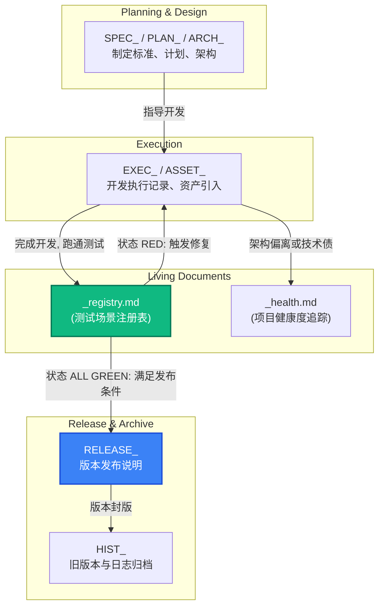

# 文档前缀规范 (Document Prefix Standards)

## 1. 概述
为保证 Emberois 旗下所有项目（特别是 AI 辅助开发项目）中的文档体系井然有序，便于快速检索、分类和解析，所有工程文档（Markdown文件）均需采用标准化的“前缀命名法”。

文档的标准命名格式为：`[PREFIX]_[YYYYMMDD]_[DOCUMENT_NAME].md`
例如：`SPEC_20260702_API_DESIGN.md`。

## 2. 标准前缀体系

以下是完整且标准的文档前缀定义，涵盖了项目的整个生命周期：

### 2.1 规范与规划类
*   **SPEC_ (Specification / 规范)**
    *   **用途**：用于项目规范、技术标准、API设计文档、需求说明书、开发指南等具有约束性的标准文档。
    *   **示例**：`SPEC_20260702_GITHUB_RELEASE_PLAN.md`, `SPEC_20260520_GLOBAL_DEVELOPMENT_STANDARDS.md`
*   **PLAN_ (Plan / 计划)**
    *   **用途**：用于前瞻性的实施计划、迭代规划、版本排期、重构方案（取代原有的 `RPLAN_`）等。
    *   **示例**：`PLAN_20260702_V1_BETA_ITERATION.md`
*   **WFLOW_ (Workflow / 工作流)**
    *   **用途**：用于工作流指南、SOP（标准作业程序）、自动化流程（CI/CD）说明等。
    *   **示例**：`WFLOW_20260626_SOLO_AI_DEV_CYCLE.md`
*   **ARCH_ (Architecture / 架构)** *(新增)*
    *   **用途**：专门用于系统架构图、数据库拓扑结构、核心技术栈说明等底层架构文档。
    *   **示例**：`ARCH_20260702_CORE_SYSTEM_TOPOLOGY.md`

### 2.2 执行与审查类
*   **EXEC_ (Execution / 执行)**
    *   **用途**：用于执行记录、操作任务单 (Task)、开发笔记、Walkthrough 等记录开发执行过程的文档。
    *   **示例**：`EXEC_20260702_DB_MIGRATION_WALKTHROUGH.md`
*   **AUDIT_ (Audit / 审查)**
    *   **用途**：用于代码审查、全面排查、资产清点、架构差距分析等“摸底”与审查性质的报告。
    *   **示例**：`AUDIT_20260702_SECURITY_VULNERABILITY_CHECK.md`

### 2.3 测试与报告类
*   **TEST_ (Test / 测试)**
    *   **用途**：用于测试用例、测试策略、自动化测试配置说明等（偏向于如何测试）。
    *   **示例**：`TEST_20260702_E2E_CASES.md`
*   **REPORT_ (Report / 报告)**
    *   **用途**：用于测试结果报告、BUG 分析报告、性能评估报告等（偏向于测试后的结果）。
    *   **示例**：`REPORT_20260702_PERFORMANCE_EVALUATION.md`

### 2.4 资源与辅助类
*   **ASSET_ (Asset / 资产)** *(新增)*
    *   **用途**：专门用于美术资源清单、音效清单、UI切图规范、CG提示词记录等（统一取代零散的 `CG_` 等前缀）。
    *   **示例**：`ASSET_20260702_BGM_TRACK_LIST.md`, `ASSET_20260629_CG_PROMPTS.md`
*   **DICT_ (Dictionary / 字典)**
    *   **用途**：用于术语表、数据字典、多语言对照表、设定集等基础数据字典。
    *   **示例**：`DICT_20260616_TERMINOLOGY_DICTIONARY.md`
*   **HIST_ (History / 历史)**
    *   **用途**：用于开发日志 (Dev Log)、历史归档记录、旧版本弃用文档。
    *   **示例**：`HIST_20260702_DEV_LOG.md`
*   **MEET_ (Meeting / 会议)** *(新增)*
    *   **用途**：专门用于会议纪要、讨论结论、头脑风暴记录等。
    *   **示例**：`MEET_20260702_TEAM_SYNC_NOTES.md`

### 2.5 发布与交付类
*   **RELEASE_ (Release / 发布)** *(新增)*
    *   **用途**：用于版本发布说明（Release Notes）、更新日志、交付清单等。必须在 `_registry.md` 全绿状态下生成。
    *   **示例**：`RELEASE_20260702_V1.0.0.md`, `RELEASE_20260702_BETA_UPDATE.md`

## 3. 特殊例外：活文档与 Registry 体系 (Living Documents)

依据全局开发规范，以下特殊文件属于 **“活文档 (Living Documents)”**。它们**不遵循** `[PREFIX]_[YYYYMMDD]_[NAME].md` 的命名与归档规范，而是直接存放在源代码/测试目录下，原地持续更新：

*   **`_registry.md` (场景测试注册表)**
    *   **位置**：存放在场景测试目录下（例如 `src/test/scenarios/_registry.md`）。
    *   **用途**：记录所有可测试质量条目的 RED/GREEN 状态。它是项目能否发布的唯一标准。
    *   **更新规范**：每次修复 Bug 或交付功能时，必须原地更新其对应的状态条目与变更日志，不建新文件。
*   **`_health.md` (项目健康仪表盘)**
    *   **位置**：通常与 `_registry.md` 同目录。
    *   **用途**：用于追踪不可测试的架构风险、设计偏离（Design Drift）与技术债。
    *   **更新规范**：在周末或项目里程碑节点定期评估并原地更新。

> [!IMPORTANT]
> **开发规程与文档剪裁规则**：
> *   对于 **影响范围较小的 Bug 修复**（通常修改文件数 $\le 5$ 个），**无需**生成 `EXEC_` 三位一体文档，直接将 `_registry.md` 中对应条目从 RED 更改为 GREEN 即可完成交付。
> *   对于 **重大功能迭代或架构重构**，除了必须让 `_registry.md` 全绿之外，仍需按规范生成 `EXEC_` 三位一体归档文档。

## 4. 弃用前缀说明
为保证规范的整洁，以下非标准前缀将被弃用并逐步迁移至新前缀：
*   `RPLAN_` (Refactor Plan) -> 统一合并至 **`PLAN_`** 或 **`SPEC_`**。
*   `CG_` (CG Prompts) -> 统一合并至 **`ASSET_`**。

## 5. 落地要求
*   新建任何工程文档时，必须从此规范中挑选最符合的前缀。
*   AI 助手在规划（Planning Mode）和执行（Execution）生成诸如 `walkthrough.md`，`implementation_plan.md`，`task.md` 时，如果要将其长期落盘保存，也应加上 `EXEC_`，`PLAN_` 等标准前缀和日期。

## 6. 文档与开发流转关系 (Documentation Lifecycle Workflow)

通过活文档体系（Living Documents）与版本发布文档（RELEASE），形成了一套闭环的 AI 驱动开发工作流。

在这个循环中，**`_registry.md` 是核心的枢纽（Gatekeeper）**：只有当 `_registry.md` 中的所有测试条目均变为 GREEN 时，才能触发 `RELEASE_` 文档的编写和正式版本的发布。
