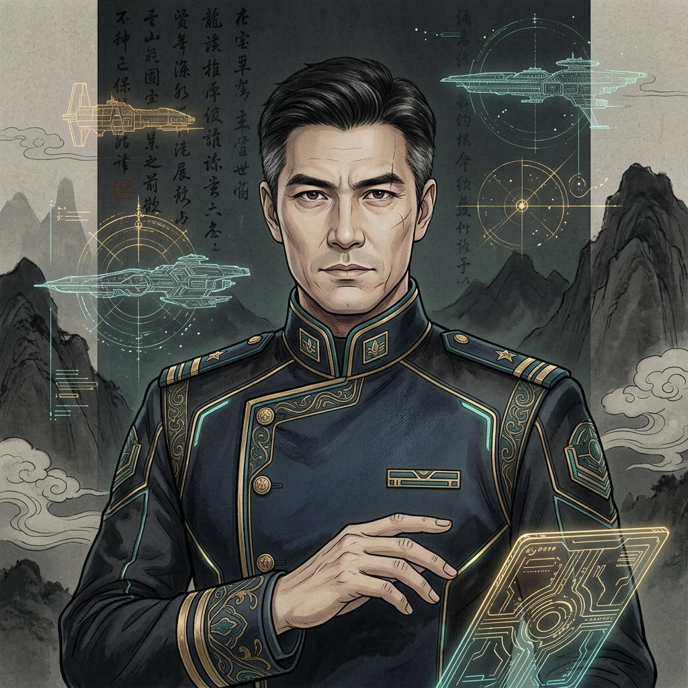

# 🌌 《光锥之外：纪元往事》
## Beyond the Light Cone: Epoch Chronicles

> （原名：*Legend of Uni Rebuild · 宇宙群英传重构计划*）
>
> *「失去人性，失去很多；失去兽性，失去一切。」*
>
> —基于《三体》宇宙观的硬核回合制 **4X 太空策略模拟游戏**

---

<div align="center">

[](#)
[](https://elyseejuly.github.io/beyond-the-light-cone/)
[](#-技术栈)
[](#-本地运行)
[-9b59b6.svg)](#-本地运行)
[](#-开源协议--license)

<br>

👉 **[在线游玩 · Web 正式版 v1.0](https://elyseejuly.github.io/beyond-the-light-cone/)** 👈

</div>

---

## 🌠 项目简介

《光锥之外：纪元往事》是基于经典 **《宇宙群英传》(Legend of Uni)** 核心策略框架的现代化 Web 重写与系统架构重构项目，现已完成 v1.0.0 正式版本。

你将在 **2009 年的危机纪元** 中临危受命，担任联合政府最高执政官。面对三体舰队迫近的末日危机，你需要在：

- 🧘‍♂️ **面壁计划** & **执剑人威慑**
- 🏰 **掩体城防御** & **光粒躲避**
- 🚀 **曲率驱动 / 光速飞船逃亡**
- 🧠 **意识上传 · 数字方舟**
- ⚫ **黑域安全声明**
- 🌍 **流浪地球远征**
- 📡 **引力波广播 · 黑暗森林打击**

之间做出抉择，在多文明竞逐的 **黑暗森林** 宇宙中，为人类文明搏得一线生机——或见证其以 12 种不同姿态走向终局。

---

## 🎨 游戏画面 · CG 与角色

> 所有画面均来自游戏内**真实渲染的 CG 与角色立绘**，采用统一的 **Craig Mullins 极简巨物画风**（21:9 电影画幅）。

| 🎬 事件 CG · 威慑建立（罗辑对决三体世界） | 🧑‍🚀 角色立绘 · 章北海 |
| :---: | :---: |
|  |  |

---

## ✨ 核心特色

| 系统 | 说明 |
| :--- | :--- |
| ⏳ **六大文明纪元演进** | 危机 → 威慑 → 广播 → 掩体 → 银河 → 星屑，每切换纪元触发史诗级 21:9 全屏电影 CG 宣言 + 专属 BGM |
| 🏭 **四维资源生产链** | 采矿 / 加工工厂 / 文化推广 / 人口繁衍，与《三体》世界观深度耦合（思想钢印、重核聚变、强相互作用材料…） |
| 🔬 **85 节点 × 5 分支科技树** | 基础物理 / 航天工程 / 军事武器 / 信息技术 / 星际文明，每条分支通向独特结局 |
| 🎭 **12 种差异化结局** | **6 胜利**（征服/威慑/黑域/流浪/数字永生/死神永生隐藏结局）+ **4 失败**（背叛/灭绝/氦闪/二向箔）+ **2 中立**（永恒流亡/宇宙静默）|
| 🏛️ **跨周目遗迹 NG+** | 失败文明的科技 / 文化持久化至 `LocalStorage`/`IndexedDB`，新周目深空探测器可发现"平行时间线飞船遗迹"并逆向继承 |
| ⏪ **命运分歧点回溯** | 自动快照最近 10 回合，失误暴毙或氦闪时一键回溯至 **5 回合前** 关键决策点 |
| 👁️ **宇宙观察者模式** | 文明消亡后退出决策角色，静观外星 AI 竞逐与宇宙演化 |
| 🖼️ **42 张电影级 CG + 16 张结局图** | 全量 Craig Mullins 风格统一画风；涵盖从红岸基地到归零者广播的完整剧情节点 |
| 👥 **36 位统一风格角色立绘** | 罗辑、章北海、程心、维德、云天明、庄颜、叶文洁… AI 统一生成的电影风角色立绘 |
| 🎵 **14 首原创 OST 配乐** | 6 纪元主题 BGM + 7 结局专属曲目 + 岁月底座；由 `AtmosphereEngine` 动态氛围引擎驱动 |
| 🎧 **星海留声机** | 内置音乐播放器，可自由切换纪元 BGM，解锁结局后永久收藏曲目 |
| 📱 **PWA + 响应式 + 移动端** | 支持离线缓存、安装至主屏/桌面；移动端底部导航栏自适应布局 |
| 🖥️ **Tauri 桌面端** | 原生打包支持 Windows (x86_64) 与 macOS (Apple Silicon) |
| ✅ **全量自动化测试** | Vitest 单元测试 + Playwright E2E + 500 回合 Headless 自动推演 |

---

## 🎮 快速开始 · 本地运行

### 环境要求

- **Node.js ≥ 20**
- **npm ≥ 10**
- （桌面端可选）**Rust + Tauri CLI** 环境

### 启动 Web 版本

```bash
# 1. 进入工程目录
cd 03_Web_Rebuild

# 2. 安装依赖
npm install

# 3. 启动开发服务器
npm run dev
# → 默认打开 http://localhost:5173
```

### 构建与部署

```bash
# 构建生产版本（自动生成 asset 清单 + TS 类型检查 + Vite 打包）
npm run build

# 本地预览构建产物
npm run preview

# 构建 PWA 版本（含图标生成 + 完整资源清单）
npm run pwa:build

# 部署到 GitHub Pages
npm run deploy

# 或部署到 Cloudflare Pages
npm run deploy:cf
```

### 桌面端（Tauri）

```bash
cd 03_Web_Rebuild
npm run tauri:dev         # 开发模式
npm run tauri:build       # 打包当前系统版本
npm run tauri:build:win   # Windows (x86_64-pc-windows-msvc)
npm run tauri:build:mac   # macOS (aarch64-apple-darwin)
```

### 质量检查与测试

```bash
npm run typecheck         # TypeScript 零错误零警告验证
npm run lint              # ESLint 代码风格校验
npm run lint:fix          # 自动修复可修复问题
npm run test              # 运行全部单元测试 (Vitest)
npm run test:core         # 仅运行核心逻辑测试
npm run test:coverage     # 覆盖率报告
npm run test:e2e          # Playwright 端到端测试
```

---

## 🧭 玩法指引 · 五分钟上手

### 📍 四阶段攻略线

1. **第 1–10 回合 · 生存与面壁**
   在危机纪元下分配工人至采矿/加工部门，优先研发「化学推进」与「恒星级氢弹」；尽早任命一位面壁者，注意 ETO 渗透。

2. **第 10–80 回合 · 威慑建立**
   协助罗辑建立黑暗森林威慑体系；同步推进「行星发动机 / 工质核聚变」与「思想钢印」科技路线；时刻警惕三体水滴的突袭。

3. **第 80–200 回合 · 广播与掩体**
   若威慑破裂则启动引力波广播；根据你选定的胜利路线向**掩体城 / 曲率驱动 / 意识上传**三条路线倾斜资源；注意黑暗森林打击倒计时。

4. **第 200 回合+ · 终局抉择**
   触发结局条件，进入对应结局 CG 过场：

   | 结局类型 | 结局 | 达成路线 |
   | :--- | :--- | :--- |
   | 🏆 胜利 | **黑域·永恒琥珀** | 曲率驱动 → 黑域生成（安全声明） |
   | 🏆 胜利 | **流浪·行星远征** | 建成行星发动机Ⅲ型 → 带地球流浪 |
   | 🏆 胜利 | **数字永生** | 意识上传完成 → 数字方舟启航 |
   | 🏆 胜利 | **威慑胜利** | 保持高威慑度直至三体文明妥协 |
   | 🏆 胜利 | **征服胜利** | 军事科技压制外星文明 |
   | 🏆 胜利 | **死神永生（隐藏）** | 走完整归零者路线 → 小宇宙生态球 |
   | 💀 失败 | **二向箔降维** | 广播后未及时掩体/逃亡 |
   | 💀 失败 | **太阳氦闪** | 未在太阳老化前逃离 |
   | 💀 失败 | **文明崩溃** | 逃亡主义失控、内部瓦解 |
   | 💀 失败 | **文明灭绝** | 人口/资源归零 |
   | 🌗 中立 | **永恒的流亡** | 星舰逃离但未建立新文明 |
   | 🌗 中立 | **宇宙静默** | 文明选择自我封闭不再发声 |

   失败后会触发 **NG+ 遗迹机制**，下周目继承文化值与永久 Buff。

---

## 🛠 技术栈

| 层级 | 技术选型 |
| :--- | :--- |
| **前端框架** | React 19 · TypeScript 5 · Vite 8 |
| **样式方案** | Tailwind CSS 4 · Framer Motion · Canvas Pattern（GPU 渲染背景） |
| **UI 图标** | Lucide React |
| **数据校验** | Zod（运行时 Schema 校验） |
| **状态架构** | DIContainer 依赖注入 + EventBus 事件总线 + SliceNarrativeEngine 切片叙事 |
| **持久化** | LocalStorage（NG+ 遗迹） · IndexedDB（存档系统 `SaveManager`） |
| **PWA** | vite-plugin-pwa · Service Worker · 资产清单 `asset_manifest.json` 分层懒加载 |
| **桌面打包** | Tauri (Rust) |
| **测试体系** | Vitest (单元/集成) · Testing Library (组件) · Playwright (E2E) |
| **CI / CD** | GitHub Actions（`.github/workflows/ci.yml` / `deploy.yml` / `static.yml`）|

---

## ⚡ 性能与加载优化亮点

- **🎯 资产分层懒加载**：`asset_manifest.json` 将 200+ 资源分为 `core / crisis / deterrence / broadcast / stardust` 共 5 个资源包，按纪元渐进式加载，首屏 <1MB。
- **🖼️ 高精 CG 预加载**：`AssetLoader.preloadCoreImages()` 在进入关键剧情前异步预载对应 CG，消除弹窗闪白，实现 **CG 实时瞬间呈现**。
- **🚀 GPU 硬件加速背景**：使用 Canvas Pattern（GPU 渲染）替代逐像素 CPU 噪点绘制；低端机型 (`tier === 'low'`) 自动关闭 `requestAnimationFrame` 循环，消除发热与卡顿。
- **🧩 切片化叙事引擎**：`SliceNarrativeEngine` 将事件、对白、因果链分层流式加载，避免首屏阻塞。
- **💾 智能存档系统**：`SaveManager` + `SaveSchema` (Zod) + `IndexedDBStorage`，自动版本迁移，跨纪元安全。
- **📴 PWA 离线支持**：`service-worker` 缓存核心包，断网可继续游戏；支持安装到主屏/桌面。
- **🎵 流式音乐加载**：`AudioManager` 懒加载 OST，仅在进入对应纪元/结局时加载对应 mp3。

---

## 📂 项目结构

```
beyond-the-light-cone/
├── 01_Windows_Source/            # 原始 MFC C++ 源码（重构修复版·宇宙群英传原版）
│   ├── 3DPrelude/                # 3D 预渲染片头
│   ├── LengendOfUni/             # 核心游戏逻辑原版
│   └── MusicPlayer/              # BGM 播放器模块
│
├── 02_Project_Documentation/     # 项目文档 · 审计 · 规格 · 报告
│   ├── SPEC_*.md                 # 规格/规范（美术/结局/事件/架构/PWA/响应式）
│   ├── EXEC_*.md                 # 执行计划与 Walkthrough
│   ├── AUDIT_*.md                # 代码/叙事/时间轴/事件因果审计
│   ├── TEST_*.md                 # 测试规划与报告
│   └── HIST_*.md                 # 开发日志与历史迭代记录
│
├── 03_Web_Rebuild/               # Web 重构正式版工程（核心交付物）
│   ├── src/
│   │   ├── core/                 # 游戏核心逻辑（状态机/经济/战斗/事件/存档/叙事）
│   │   │   ├── Game.ts           # 主循环与状态机
│   │   │   ├── EarthCivilization.ts   # 人类文明数据模型
│   │   │   ├── TecTreeManager.ts      # 85 节点科技树
│   │   │   ├── EventSystem.ts         # 通用事件引擎 (UEE)
│   │   │   ├── SliceNarrativeEngine.ts# 切片化叙事
│   │   │   ├── CombatEngine.ts        # 战斗系统
│   │   │   ├── SaveManager.ts / IndexedDBStorage.ts  # 存档系统
│   │   │   ├── AtmosphereEngine.ts / AudioManager.ts # 氛围/音乐
│   │   │   └── subsystems/      # 子系统拆分（经济/人口/事件）
│   │   ├── components/           # UI 面板组件
│   │   │   ├── ending/           # 结局过场/Credits/粒子特效
│   │   │   ├── StarMap.tsx       # 主星空地图
│   │   │   ├── MuseumGallery.tsx # 岁月史书·结局画廊
│   │   │   ├── GovManagement.tsx # 政府管理
│   │   │   ├── Tutorial.tsx      # 新手引导
│   │   │   ├── MobileBottomNav.tsx   # 移动端底部导航
│   │   │   └── ...
│   │   ├── data/                 # JSON 数据层（人物/事件/武器/外星文明/纪元/星图/面壁者）
│   │   ├── config/               # 配置（endingConfig 结局/starIndices 星图）
│   │   ├── test/                 # 全量测试（Vitest + Playwright + Autoplay500）
│   │   ├── hooks/                # 自定义 React Hooks
│   │   ├── ui/                   # UIManager / 布局渲染层
│   │   └── utils/                # 工具函数（assetUrl/i18n/random）
│   ├── public/
│   │   ├── images/               # 42 CG + 16 结局 + 36 角色 + 12 NPC（PNG）
│   │   ├── audio/                # 14 首 OST（MP3）
│   │   └── icons/                # PWA 图标
│   ├── index.html
│   ├── vite.config.ts            # Vite 配置（beyond-the-light-cone 路由 base）
│   └── package.json              # 完整 npm 脚本
│
├── .github/workflows/            # CI/CD（构建/测试/部署）
└── README.md
```

### 🔍 核心代码导读

| 文件 | 作用 |
| :--- | :--- |
| [Game.ts](file:///Users/quantumrose/Documents/Emberois/Beyond-the-Light-Cone/03_Web_Rebuild/src/core/Game.ts) | 游戏主循环、回合推进、结局判定 |
| [EarthCivilization.ts](file:///Users/quantumrose/Documents/Emberois/Beyond-the-Light-Cone/03_Web_Rebuild/src/core/EarthCivilization.ts) | 人类文明核心数据模型 |
| [endingConfig.ts](file:///Users/quantumrose/Documents/Emberois/Beyond-the-Light-Cone/03_Web_Rebuild/src/config/endingConfig.ts) | 12 种结局配置（文案 / 渐变 / 粒子 / BGM / 配图） |
| [TecTreeManager.ts](file:///Users/quantumrose/Documents/Emberois/Beyond-the-Light-Cone/03_Web_Rebuild/src/core/TecTreeManager.ts) | 85 节点科技树调度 |
| [SliceNarrativeEngine.ts](file:///Users/quantumrose/Documents/Emberois/Beyond-the-Light-Cone/03_Web_Rebuild/src/core/SliceNarrativeEngine.ts) | 切片化叙事与事件因果链 |
| [AssetLoader.ts](file:///Users/quantumrose/Documents/Emberois/Beyond-the-Light-Cone/03_Web_Rebuild/src/core/AssetLoader.ts) | 资产分层懒加载与资源清单管理 |
| [AtmosphereEngine.ts](file:///Users/quantumrose/Documents/Emberois/Beyond-the-Light-Cone/03_Web_Rebuild/src/core/AtmosphereEngine.ts) | 动态氛围与粒子系统 |
| [SaveManager.ts](file:///Users/quantumrose/Documents/Emberois/Beyond-the-Light-Cone/03_Web_Rebuild/src/core/SaveManager.ts) | 存档/读档/版本迁移 |
| [MuseumGallery.tsx](file:///Users/quantumrose/Documents/Emberois/Beyond-the-Light-Cone/03_Web_Rebuild/src/components/MuseumGallery.tsx) | 岁月史书·永久结局画廊 |
| [EndingCinematic.tsx](file:///Users/quantumrose/Documents/Emberois/Beyond-the-Light-Cone/03_Web_Rebuild/src/components/ending/EndingCinematic.tsx) | 电影级结局过场 |

---

## 🧪 测试体系

本项目配备四层自动化测试保障，所有测试在 GitHub Actions CI 上自动运行：

1. **🧪 单元测试（Vitest）**：覆盖核心数据模型、科技树、经济子系统、战斗引擎、结局判定、防绕过逻辑、事件标签系统 —— 位于 `src/test/core/`
2. **🔗 集成测试**：事件因果链 `EventChain`、存档读档 `SaveLoad`、标签事件互作 `TagEventIntegration`、通用事件引擎 `UEE_FullFlow` —— 位于 `src/test/integration/`
3. **🎭 E2E 测试（Playwright）**：烟雾测试 `smoke`、核心流程 `core-flow`、响应式布局 `responsive` —— 位于 `src/test/e2e-playwright/`
4. **🤖 Headless 自动推演**：`Autoplay500` 自动模拟 500 回合无交互推演，验证长期数值稳定性与异常结局

运行方式见上方「[质量检查与测试](#-质量检查与测试)」命令清单。

---

## 📜 开源协议 (License)

- **代码部分**：采用 **MIT License** 开源 —— 欢迎学习、Fork、二次开发、提交 PR。
- **美术资源（CG / 立绘 / 结局图）· OST 音乐 · 文字文案 · 《三体》世界观设定**：版权归原作者及版权方（刘慈欣 / 《三体》版权方）所有，**仅限学习、交流与非商业性试玩体验使用**，请勿用于任何商业用途。

---

## 🤝 贡献指南（Welcome Contributors）

欢迎提交 **Issue / Pull Request**！请遵循以下流程：

1. **Fork 本仓库** → 在你的分支上进行改动。
2. 代码提交前请在 `03_Web_Rebuild/` 下运行以下命令（CI 也会执行）：
   ```bash
   npm run typecheck   # 必须零错误零警告
   npm run lint        # 代码风格检查
   npm run test        # 单元测试全部通过
   ```
3. 新增功能 / 修复 Bug 时，请**同步补充对应 Vitest 用例**，并在 commit message 中简短说明。
4. 美术资源（CG / 立绘 / 音乐）请严格遵循 [SPEC_20260622_ART_PROMPTS_GUIDE.md](file:///Users/quantumrose/Documents/Emberois/Beyond-the-Light-Cone/02_Project_Documentation/SPEC_20260622_ART_PROMPTS_GUIDE.md) 的统一 Craig Mullins 画风视觉规范。
5. 提交 PR 后，GitHub Actions CI 会自动运行 typecheck / lint / test / build，通过后维护者将 Review。

---

## 📖 延伸阅读

项目在 `02_Project_Documentation/` 下维护了完整的开发与设计文档库（超过 80 篇规格 / 审计 / 执行报告），推荐从以下几篇开始深入：

| 文档 | 内容 |
| :--- | :--- |
| [AUDIT_20260622_ARCHITECTURE_REBUILD.md](file:///Users/quantumrose/Documents/Emberois/Beyond-the-Light-Cone/02_Project_Documentation/AUDIT_20260622_ARCHITECTURE_REBUILD.md) | v1.0 完整架构重构审计 |
| [SPEC_20260621_ENDING_TRIGGER_PATHS_REDESIGN.md](file:///Users/quantumrose/Documents/Emberois/Beyond-the-Light-Cone/02_Project_Documentation/SPEC_20260621_ENDING_TRIGGER_PATHS_REDESIGN.md) | 12 种结局触发路径设计 |
| [SPEC_20260622_ART_PROMPTS_GUIDE.md](file:///Users/quantumrose/Documents/Emberois/Beyond-the-Light-Cone/02_Project_Documentation/SPEC_20260622_ART_PROMPTS_GUIDE.md) | 美术资源提示词统一规范 |
| [EXEC_20260621_CG_ASSETS_COMPLETION_REPORT.md](file:///Users/quantumrose/Documents/Emberois/Beyond-the-Light-Cone/02_Project_Documentation/EXEC_20260621_CG_ASSETS_COMPLETION_REPORT.md) | CG 重绘与结局视觉补全报告 |
| [AUDIT_20260622_EVENT_CAUSALITY_ANALYSIS.md](file:///Users/quantumrose/Documents/Emberois/Beyond-the-Light-Cone/02_Project_Documentation/AUDIT_20260622_EVENT_CAUSALITY_ANALYSIS.md) | 事件因果链完整分析 |
| [SPEC_20260621_PWA_UPGRADE.md](file:///Users/quantumrose/Documents/Emberois/Beyond-the-Light-Cone/02_Project_Documentation/SPEC_20260621_PWA_UPGRADE.md) | PWA 升级与离线缓存设计 |
| [SPEC_20260621_RESPONSIVE_LAYOUT.md](file:///Users/quantumrose/Documents/Emberois/Beyond-the-Light-Cone/02_Project_Documentation/SPEC_20260621_RESPONSIVE_LAYOUT.md) | 移动端响应式布局规范 |

---

## 🌟 Star History

如果这个项目让你对《三体》与太空策略游戏产生了兴趣，欢迎 **Star ⭐ / Fork 🍴 / Watch 👁**，让更多人看到它！

> *"给岁月以文明，而不是给文明以岁月。"*
>
> *"宇宙就是一座黑暗森林，每个文明都是带枪的猎人……他必须小心，因为林中到处都有与他一样潜行的猎人。"*
>
> ——刘慈欣《三体Ⅱ·黑暗森林》
